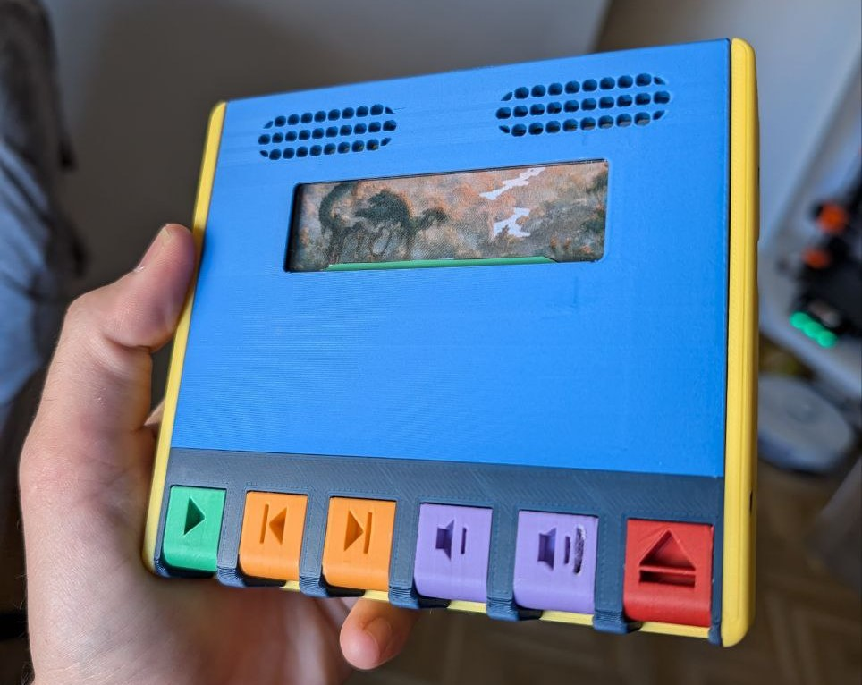
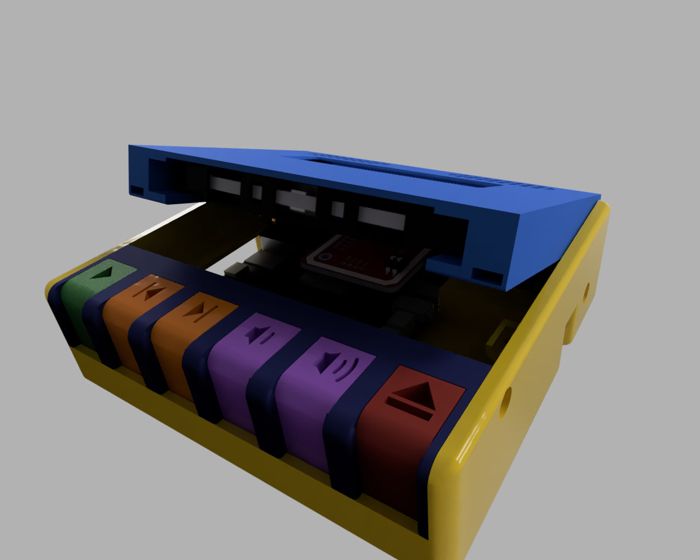
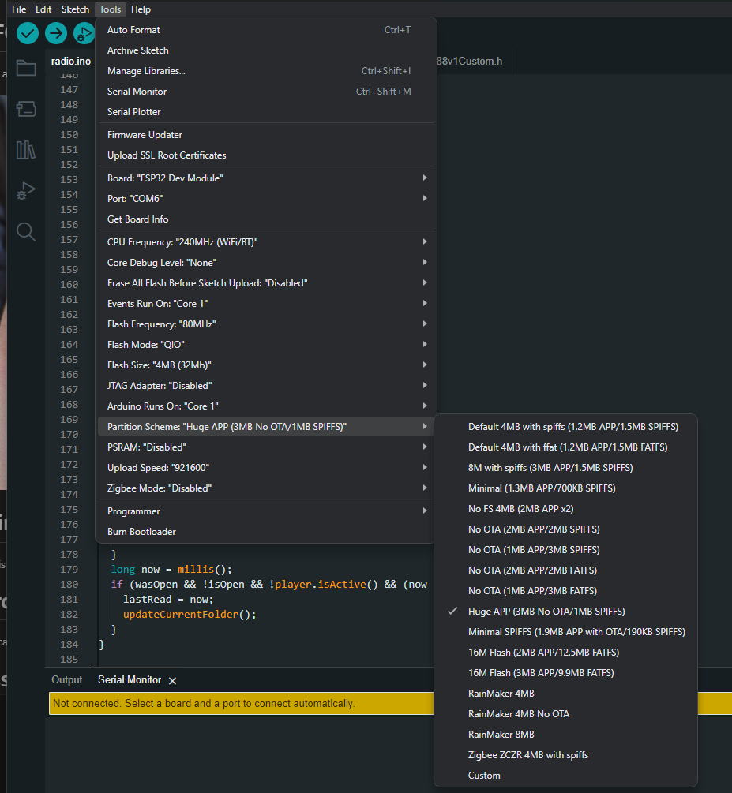

# NFC based radio for kids

Uses a ESP32 A1S + PN532 NFC reader to mimic and old-school walkman

# Printing

PLA is fine, tolerances should allow for some wiggle room if your printer is not totally dialed in. Tested at 0.2mm layer height. Don't forget to follow on [printables](https://www.printables.com/model/1038471-nfc-walkman)!

# Ordering parts

You can check out the BOM [here](./docs/BOM.md)

# Assembly

Check out the guide [here](./docs/assembly.md)

# Flashing the code

The ESP32 A1S should be flashed with the `radio.ino` file. 

1. You will have to download and install the libraries at the top of the code, using the provided github links.
2. Use the ESP32 Dev Module board type
3. In compilation options, make sure to select "Huge app" partition scheme:

4. Click on upload!

# Operation

1. Get a microSD card and create a folder for each "cassette tape". Put some .mp3 files in each folder. Try to limit to ASCII characters!
2. Print some cassetes, and write an NFC tag for each, following the convention `P->foldername`. For example, if I have a folder in the SD card for "myalbum", the NFC tag should be written with a text record containing `P->myalbum`. (I used [Android NFC tools](https://play.google.com/store/apps/details?id=com.wakdev.wdnfc&hl=en) for this).
3. That's it! Turn on your walkman, insert your tape, and press play!

# Acknoledgements

* [Cassette model](https://www.printables.com/model/505572-cassette-tape) remixed from [Pete Farell](https://www.printables.com/@PeterFarell)'s design.
