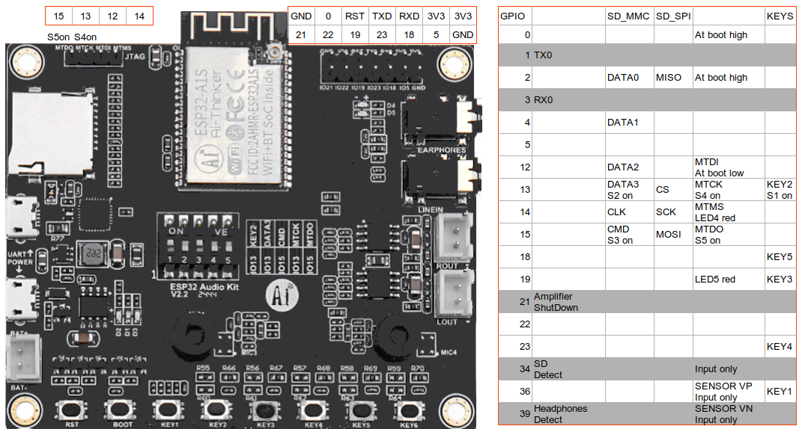
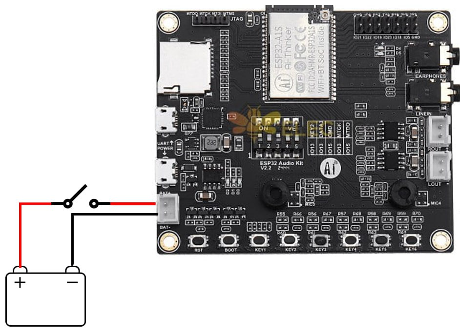
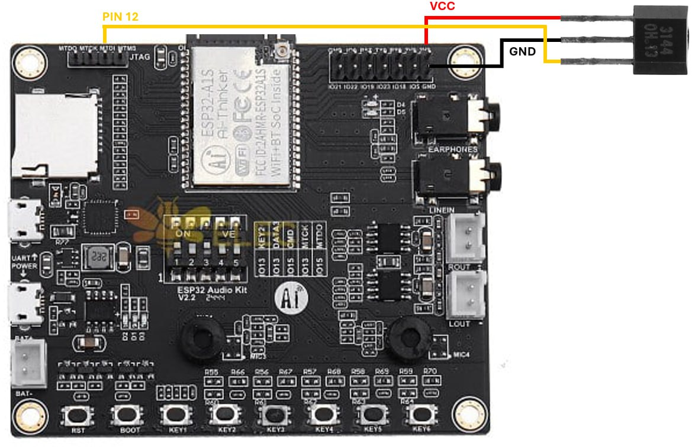
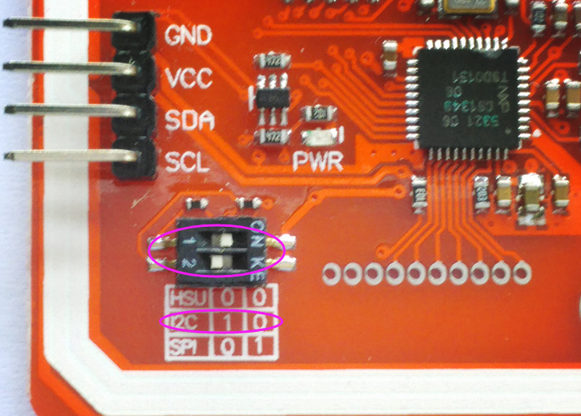
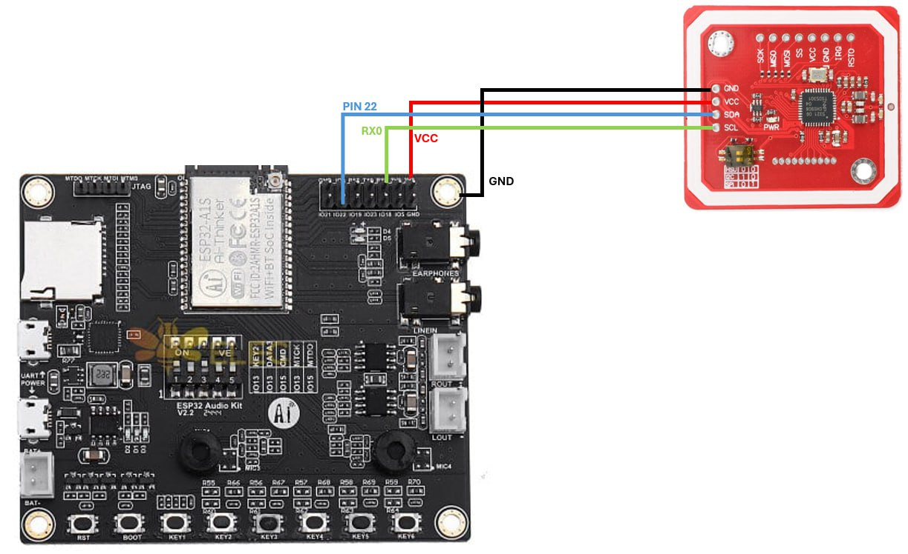
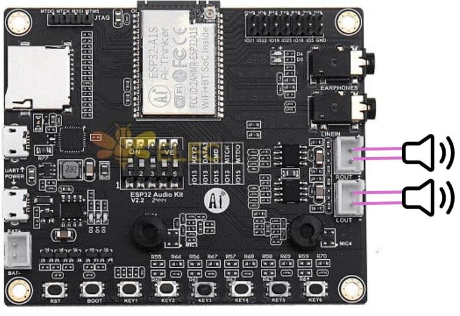
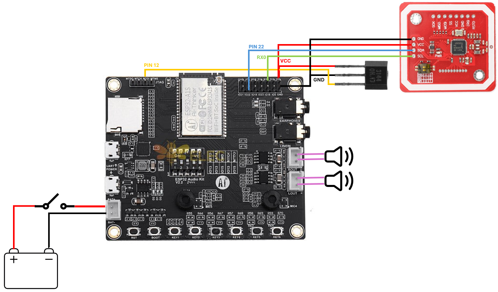
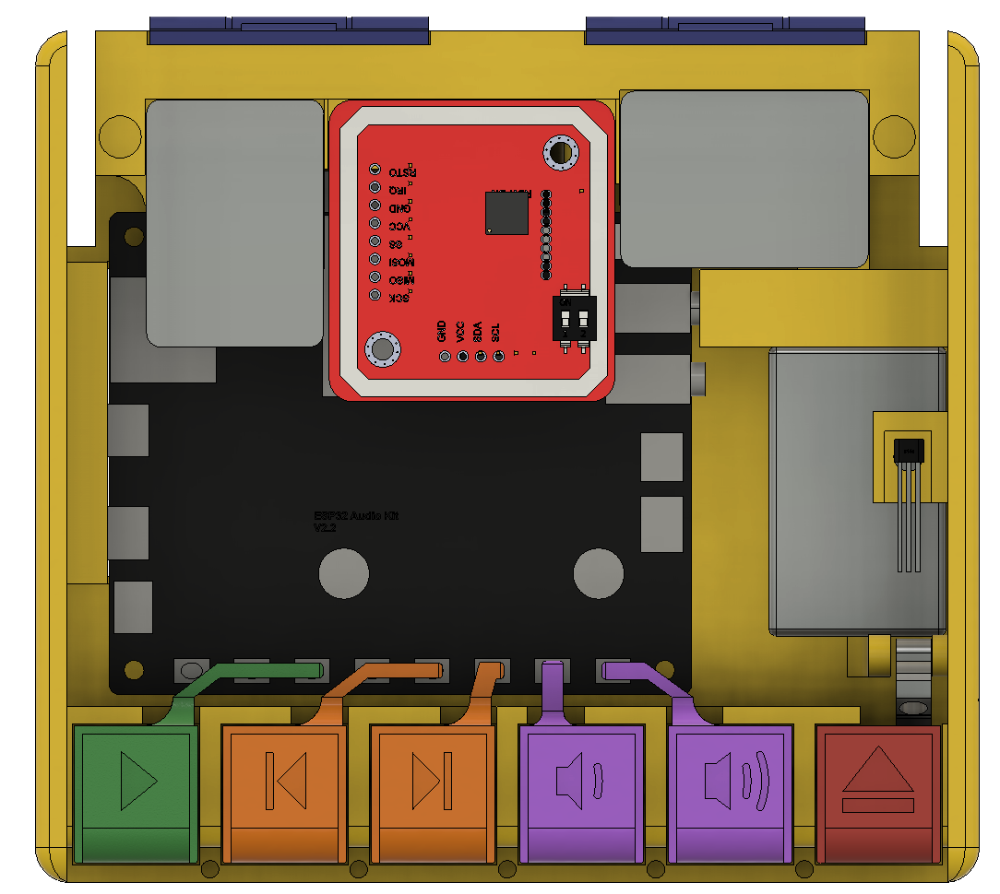

# Wiring

## Preparation

Space is at a premium, so it is recommended to either desolder or cut all pins and connectors from the ESP32 A1S board. Every connection is going to be soldered on!

Switches should be in the following configuration: **ON | ON | ON | OFF | OFF**

## Battery

The battery cables should be long enough to run underneath the ESP32 when mounted to the base. The switch should interrupt one of them:

## Hall effect sensor

The hall effect sensor *MUST* be mounted with the beveled side facing **UP**. Only one magnet orientation is going to trigger it, so it is recommended to test this before finalizing the assembly.

## NFC
Make sure the PN532 is in I2C mode!

After that, connect it as follows:

## Speakers

Solder the speakers as follows:

## Putting it all together

# Assembly

Check out the diagram below to understand how it all fits together. It is recommended to do the wiring first!  

Every button has a spring underneath it, and the lid requires another one so that it opens automatically.

The ejection mechanism requires the magnet in the button and the lock to be oriented so they repel each other. *DO NOT TIGHTEN* the screw that holds the lock or it won't work! Worst case scenario, the holder can break and a new base would have to be printed.
